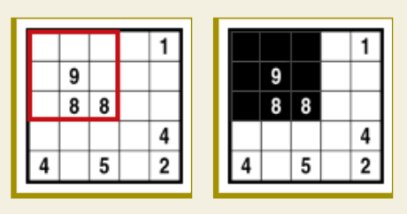

# Toteutus

## Käyttöliittymä
Ohjelmassa on komentorivikäyttöliittymä.
komentorivikäyttöliittymän avulla näet src/games kansiossa olevat tiedostot ja voit helposti valita haluamasi tiedoston.

## Ratkaisun toteutus
Pelin ratkaiseminen on jaettu kolmeen eri vaiheeseen.

Vaihe 1:
Ensin täytetään mustalla numeort 9 sekä tyhjällä numerot 0.

Vaihe 2:
Seuraavaksi käsitellään muut numerot 1-8.
Jokainen ei käsitelty numero käydään läpi ja katsotaan voidaanko se täyttää.
Numeron täytyy täyttää jokin seuraavista ehdoista:
- Mustia on oikea määrä -> täytetään muut valkoisilla
- Valkoisia on oikea määrä (ruutujen määrä - numero) -> täytetään muut ruudun mustilla

Numeroita käydään niin pitkään läpi kun on mahdollista täyttää.

Toisen vaiheen jälkeen peli on ratkaistu niin pitkälle kun voidaan vamasti tehdä ilman arvaamista.
Helpoimmat pelit ovat tässä vaiheessa valmiita. Vaikeammant voivat olla hieman vielä kesken.

Jos ratkaisu on kesken niin suoritetaan vaihe 3.

vaihe 3:
Vaihe 3 valitaaan aluksi yksi numero. Sitten tutkitaan millä tavoin numeroi voidaan täyttää.
Ne vaihtoehdot jotka ovat eivät ole ristiriidassa niin niille suoritetaan vaihe 2 uudelleen.
Vaiheen 2 uudelleen suorittamisella pyritään täyttämään ruudukkoa. Jos ratkaisu ei ole valmis niin tehdään vaihe 3 uudelleen. 

Esimerkki pelejä:

Basic 15x15

Advanced 10x10:
Vaihe 1:

Vaihe 2:

Vaihe 3:

Lähteet:
- https://www.conceptispuzzles.com/index.aspx?uri=puzzle/fill-a-pix/techniques