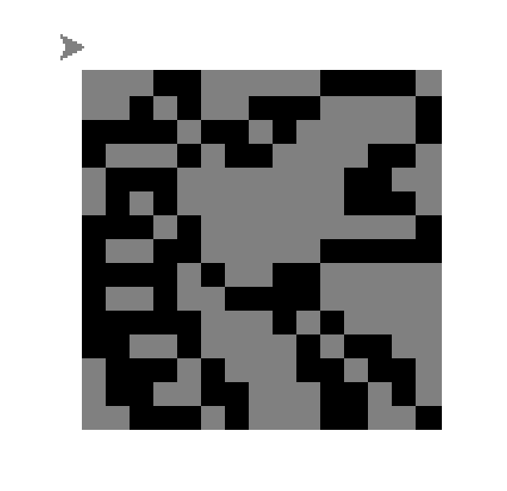
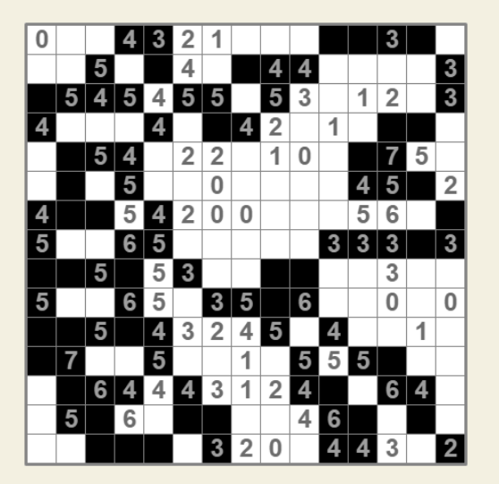

# Toteutus

## Käyttöliittymä
Ohjelmassa on komentorivikäyttöliittymä.
komentorivikäyttöliittymän avulla näet src/games kansiossa olevat tiedostot. Syöttämällä tiedoston vieressä oleva numero alkaa ohjelma etsiä tälle pelille ratkaisua.

komentorivikäyttöliittymä on tämän näköinen:


## Ratkaisun toteutus
Pelin ratkaiseminen on jaettu kolmeen eri vaiheeseen.

**Vaihe 1:**

Ensin täytetään mustalla numeort 9 sekä tyhjällä numerot 0.


**Vaihe 2:**

Seuraavaksi käsitellään muut numerot 1-8.
Jokainen ei käsitelty numero käydään läpi ja katsotaan voidaanko se täyttää.
Numeron täytyy täyttää jokin seuraavista ehdoista:
- Mustia on oikea määrä -> täytetään muut valkoisilla
- Valkoisia on oikea määrä (ruutujen määrä - numero) -> täytetään muut ruudun mustilla

Numeroita käydään niin pitkään kun mahdollisia täyttöjä löytyy.


Toisen vaiheen jälkeen peli on ratkaistu niin pitkälle kun voidaan vamasti tehdä ilman arvaamista.
Helpoimmat pelit ovat tässä vaiheessa valmiita. Vaikeammant voivat olla hieman vielä kesken.

Jos ratkaisu on kesken niin suoritetaan vaihe 3.

**vaihe 3:**

Vaihe 3 valitaaan aluksi yksi numero. Sitten tutkitaan millä tavoin numeroi voidaan täyttää.
Ne vaihtoehdot jotka ovat mahdollisia eli eivät ole ristiriidassa niin niille suoritetaan vaihe 2 uudelleen.
Vaiheen 2 uudelleen suorittamisella pyritään täyttämään ruudukkoa. Tämän jälkeen tarkistetaan, ettei peliin ole syntynyt ristiriitoja. Jos peli on valmis niin tulos palautetaan muuten suoritetaan 3. vaihe uudelleen

Viimeistään 3. vaiheen jälkeen tulos on valmis.

## Tulostus


Ohjelmassa on kolme eri laista vastauksen tulostamis vaihtoehtoa.
Ensimmäinen on komentoriville tuleva tulos.
Komentoriville tulostuu jokaisen vaiheen jälkeen sen hetkinen tianne.
1 tarkoittaa mustaa ruutua
0 tarkoittaa valkoista ruutua 
ja None tarkoitta että ei vielä tiedetä onko musta vai valkoinen

Tulostun on tämän tyylinen:
```
vaihe 1
[0, 0, None, None, None, None, None, None, None, None, None, None, None, None, None]
[0, 0, None, None, None, None, None, None, None, None, None, None, None, None, None]
[None, None, None, None, None, None, None, None, None, None, None, None, None, None, None]
[None, None, None, None, None, None, None, None, 0, 0, 0, None, None, None, None]
[None, None, None, None, None, 0, 0, 0, 0, 0, 0, None, None, None, None]
[None, None, None, None, None, 0, 0, 0, 0, 0, 0, None, None, None, None]
[None, None, None, None, None, 0, 0, 0, 0, None, None, None, None, None, None]
[None, None, None, None, None, 0, 0, 0, 0, None, None, None, None, None, None]
[None, None, None, None, None, None, None, None, None, None, None, 0, 0, 0, 0]
[None, None, None, None, None, None, None, None, None, None, None, 0, 0, 0, 0]
[None, None, None, None, None, None, None, None, None, None, None, 0, 0, 0, 0]
[None, None, None, None, None, None, None, None, None, None, None, None, None, None, None]
[None, None, None, None, None, None, None, None, None, None, None, None, None, None, None]
[None, None, None, None, None, None, None, 0, 0, 0, None, None, None, None, None]
[None, None, None, None, None, None, None, 0, 0, 0, None, None, None, None, None]
vaihe 2
[0, 0, 0, 1, 1, 0, 0, 0, 0, 0, 1, 1, 1, 1, 0]
[0, 0, 1, 0, 1, 0, 0, 1, 1, 1, 0, 0, 0, 0, 1]
[1, 1, 1, 1, 0, 1, 1, 0, 1, 0, 0, 0, 0, 0, 1]
[1, 0, 0, 0, 1, 0, 1, 1, 0, 0, 0, 0, 1, 1, 0]
[0, 1, 1, 1, 0, 0, 0, 0, 0, 0, 0, 1, 1, 0, 0]
[0, 1, 0, 1, 0, 0, 0, 0, 0, 0, 0, 1, 1, 1, 0]
[1, 1, 1, 0, 1, 0, 0, 0, 0, 0, 0, 0, 0, 0, 1]
[1, 0, 0, 1, 1, 0, 0, 0, 0, 0, 1, 1, 1, 1, 1]
[1, 1, 1, 1, 0, 1, 0, 0, 1, 1, 0, 0, 0, 0, 0]
[1, 0, 0, 1, 0, 0, 1, 1, 1, 1, 0, 0, 0, 0, 0]
[1, 1, 1, 1, 1, 0, 0, 0, 1, 0, 1, 0, 0, 0, 0]
[1, 1, 0, 0, 1, 0, 0, 0, 0, 1, 0, 1, 1, 0, 0]
[0, 1, 1, 1, 0, 1, 0, 0, 0, 1, 1, 0, 1, 1, 0]
[0, 1, 1, 0, 0, 1, 1, 0, 0, 0, 1, 1, 0, 1, 0]
[0, 0, 1, 1, 1, 0, 1, 0, 0, 0, 1, 1, 0, 0, 1]
Ratkaisu oikein
```
Komentorivitulostuksesta on vaikeaa saada selvää, joten tämän takia on tehty kaksi erilaista tapaa kuvata tulosta.


Ensimmäinen visuaalinen vaihtoehto on pythonin turtlella tehty tulostus.
Tämä on hidas vaihtoehto, koska turtle tulostaa yhden kuution kerrallaa.


Toinen visuaalinen vaihtoehto on excel.
Ohjelmaan on luoto excelin tekijä joka sisältää valmiiksi luodun makron. Makro muutta ruutujen kokoa jotta ruudun olisivat neliön muotoisia sekä automaattisesti täyttää mustat ruudun. Tämä vaihtoehto toimii ainoastaan tietokoneessa johon on asennettu excel.


## Esimerkki pelejä

Basic 15x15

Vaihe 1:


Vaihe 2:




**Advanced 20x20:**

Vaihe 1:

Ensimmäisen vaiheen jälkeen tilanne on tämän näköinen:


Vaihe 2:

Toisen vaiheen jälkeen ratkaisu on näin pitkällä


Vaihe 3:

Ja tulos on tällainen


Vaiheessa 3. on valittu seuraavat numerot joita sitten ollaan testattu.


Ja iso Fill-a-pix
Kokoa on 100x60


Vaihe 1:


Vaihe 2:


Lähteet:
- https://www.conceptispuzzles.com/index.aspx?uri=puzzle/fill-a-pix/techniques
- https://www.conceptispuzzles.com/index.aspx?uri=puzzle/fill-a-pix